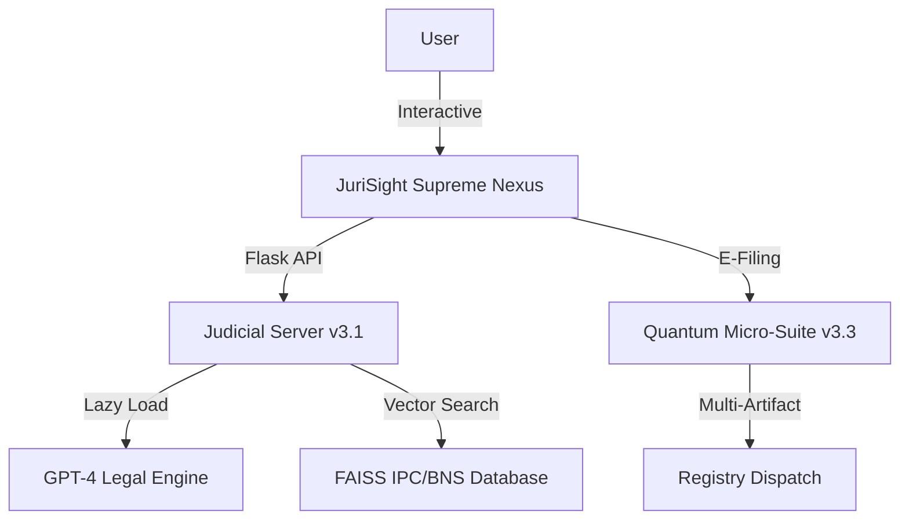

# JuriSight - Supreme AI Legal Suite 🏛️⚖️

An authoritative AI-powered legal ecosystem specializing in the **Indian Penal Code (IPC)** and **Bharatiya Nyaya Sanhita (BNS)**. JuriSight v3.3 delivers a high-performance, professional digital litigation experience with advanced RAG architecture.


## 🌟 Supreme Features

- **JuriSight Supreme Nexus**: A professional AI chat interface for complex legal queries across IPC and BNS.
- **Quantum Micro-Suite v3.3**: An ultra-compact E-Filing wizard optimized for precise procedural dispatch.
- **Artifact Certification Vault**: Advanced document analysis and multi-artifact synchronization.
- **Lazy Load Registry v3.1**: Intelligent backend initialization that prevents startup latency by deferring AI model loading.
- **Supreme Judicial Aesthetics**: A prestigious Deep Obsidian and Burnished Gold theme designed for professional legal environments.
- **IPC ↔ BNS Mapping**: Real-time cross-referencing between historical and modern Indian penal provisions.

## 🏗️ Technical Architecture



## 📋 Prerequisites

- **Python 3.10+**
- **OpenAI API Credentials** (OpenRouter or Direct)
- **FAISS & LangChain** for vector intelligence
- **10GB+ Disk Space** (For high-fidelity legal embeddings)

## 🚀 Installation & Commissioning

### 1. Environment Synchronization
```bash
git clone https://github.com/MohammedInshadAbdulla/LawGPT.git
cd LawGPT
python -m venv .venv
.venv\Scripts\activate
pip install -r requirements.txt
```

### 2. Secure Credentialing
Create a `.env` file in the root directory:
```env
OPENAI_API_KEY=your_judicial_key_here
OPENAI_BASE_URL=https://openrouter.ai/api/v1
OPENAI_MODEL=openai/gpt-4o
OPENAI_TEMPERATURE=0.3
```

### 3. Artifact Ingestion
Populate the `data/` directory with legal PDFs and run the ingestion protocol:
```bash
python Ingest.py
```

### 4. Initiating the Server
```bash
python server.py
```
Access the portal at: `http://localhost:5000`

## 📁 Judicial Structure

- `server.py`: The core Flask Judicial Server with Lazy Loading.
- `efiling_assistant.py`: Logic engine for procedural e-filing.
- `Ingest.py`: High-fidelity vector database generator.
- `static/`:
  - `css/style.css`: Supreme Judicial Aesthetics v3.2.
  - `js/app.js`: Supreme Nexus communication logic.
- `templates/index.html`: Unified Portal (Nexus + Quantum Micro-Suite).

## 🛡️ Judicial Disclaimers

**IMPORTANT**: This application provides general legal information and procedural assistance. It is **NOT** a substitute for professional legal advice from a certified advocate.

---

**Made with Precision for the Indian Legal Community v3.3** 🏛️⚖️
